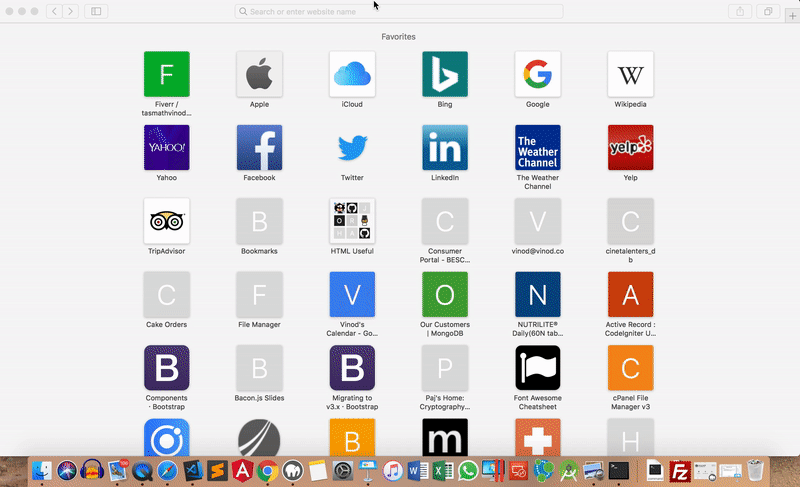

REACT &middot; REDUX &middot; THUNK

---

This is a demo app for testing CRUD operations using REDUX for state management using Thunk middleware in a ReactJS application.

* To install dependencies, run the `npm install` command
* To run the REST backend server, run the `npm run backend` command
* To run the ReactJS application, run the `npm start` command

